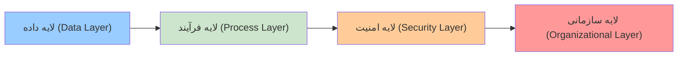
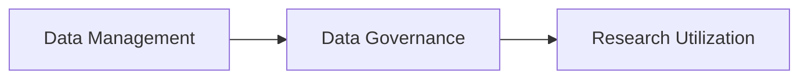
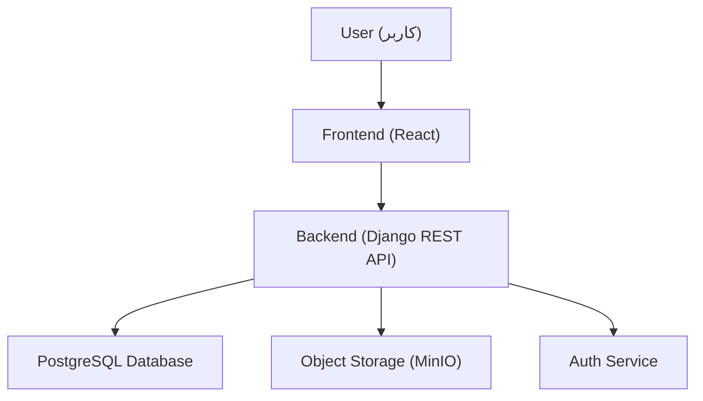
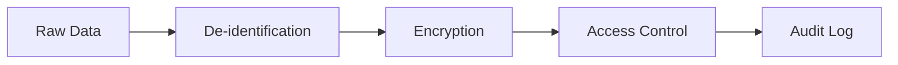
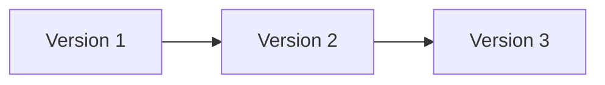

# مقدمه

در سال‌های اخیر، توسعه روش‌های مبتنی بر داده در پزشکی، به‌ویژه در حوزه‌هایی نظیر یادگیری ماشین، یادگیری عمیق، پردازش تصویر پزشکی و تحلیل سیگنال‌های زیستی، به شدت وابسته به دسترسی به داده‌های باکیفیت، ساختاریافته و قابل استفاده مجدد شده است.

در حال حاضر، در بسیاری از دانشگاه‌های علوم پزشکی، داده‌های ارزشمند بالینی و پژوهشی تولید می‌شوند، اما این داده‌ها به دلیل نبود زیرساخت مناسب، عملاً به دارایی‌های بلااستفاده تبدیل می‌شوند.

---

# بیان مسئله

مسئله اصلی، نه کمبود داده، بلکه **عدم مدیریت صحیح داده** است.

## تحلیل عمیق مسئله

مسئله مدیریت داده در دانشگاه علوم پزشکی صرفاً یک مشکل فنی نیست، بلکه یک مسئله چندبعدی شامل لایه‌های داده، فرآیند، امنیت و فرهنگ سازمانی است.

۱. لایه داده (Data Layer)

در این لایه، مشکلات زیر وجود دارد:

نبود استاندارد متادیتا
عدم یکنواختی فرمت داده‌ها
نبود schema مشخص برای dataset

📌 تعریف:
Metadata (فراداده) = داده درباره داده (مثلاً نوع داده، منبع، تاریخ تولید)

۲. لایه فرآیند (Process Layer)
فرآیند مشخصی برای ثبت Dataset وجود ندارد
کنترل کیفیت داده انجام نمی‌شود
نسخه‌بندی وجود ندارد

📌 تعریف:
Versioning (نسخه‌بندی) = نگهداری تاریخچه تغییرات داده‌ها به‌صورت ساختاریافته

۳. لایه امنیت (Security Layer)
داده‌های حساس بدون کنترل مناسب در دسترس هستند
ثبت لاگ (Logging) ناقص است

📌 تعریف:
Logging (ثبت رویداد) = ذخیره تمام فعالیت‌های کاربران و سیستم برای بررسی و امنیت

۴. لایه سازمانی (Organizational Layer)
نبود سیاست مشخص برای اشتراک داده
عدم تعریف مالکیت داده

📌 تعریف:
 (حاکمیت داده) = مجموعه سیاست‌ها و فرآیندهایی برای مدیریت داده

<a ref="https://en.wikipedia.org/wiki/Data_governance" style="text-decoration:none; color:green;" target="_blank">
<strong>
Data Governance
</strong>
    </a>

## 🧩 مرحله ۳: تعریف دقیق راه‌حل (Solution Architecture Thinking)

راه‌حل پیشنهادی یک **پلتفرم متمرکز مدیریت داده** است که سه قابلیت کلیدی را فراهم می‌کند:

1. مدیریت داده (Data Management)  
2. حاکمیت داده (Data Governance)  
3. بهره‌برداری پژوهشی (Research Utilization)  

۱. مدیریت داده (Data Management)

شامل:

ایجاد Dataset
ذخیره‌سازی فایل
تعریف متادیتا
جستجو و بازیابی

📌 تعریف:
Dataset = مجموعه‌ای از داده‌ها که برای یک هدف مشخص جمع‌آوری شده‌اند

۲. حاکمیت داده (Data Governance)

شامل:

تعیین مالک داده
تعیین سطح دسترسی
ثبت فعالیت‌ها

📌 تعریف:
Access Control (کنترل دسترسی) = تعیین اینکه چه کسی به چه داده‌ای دسترسی دارد

۳. بهره‌برداری پژوهشی

شامل:

تعریف Challenge
ارزیابی مدل‌ها
تولید دانش

📌 تعریف:
Machine Learning (یادگیری ماشین) = الگوریتم‌هایی که از داده یاد می‌گیرند

## معماری فنی سیستم (تحلیل دقیق)

۱. Frontend

📌 تعریف:
React = کتابخانه JavaScript برای ساخت رابط کاربری
https://react.dev/

وظایف:

نمایش داده‌ها
ارسال درخواست به Backend
مدیریت UI
۲. Backend

📌 تعریف:
Django = فریمورک Python برای توسعه وب
https://www.djangoproject.com/

📌 تعریف:
REST API (Representational State Transfer)
= استانداردی برای ارتباط بین سیستم‌ها
https://en.wikipedia.org/wiki/REST

وظایف:

مدیریت منطق سیستم
کنترل دسترسی
پردازش درخواست‌ها
۳. پایگاه داده

📌 تعریف:
PostgreSQL = سیستم مدیریت پایگاه داده رابطه‌ای
https://www.postgresql.org/

وظیفه:

ذخیره metadata
ذخیره روابط
۴. Object Storage

📌 تعریف:
MinIO = سیستم ذخیره‌سازی سازگار با S3
https://min.io/

📌 تعریف:
S3 (Simple Storage Service)
= استاندارد ذخیره‌سازی شیء
https://en.wikipedia.org/wiki/Amazon_S3

وظیفه:

ذخیره فایل‌های حجیم
جداسازی فایل از دیتابیس

## 🧩 مرحله ۵: امنیت (سطح حرفه‌ای پزشکی)

## امنیت داده‌های پزشکی

۱. ناشناس‌سازی

📌 تعریف:
De-identification
= حذف اطلاعات هویتی از داده

مثال:

حذف نام
حذف کد ملی
۲. رمزنگاری

📌 تعریف:
Encryption (رمزنگاری)
= تبدیل داده به فرم غیرقابل خواندن

انواع:

At Rest (در ذخیره)
In Transit (در انتقال)
۳. کنترل دسترسی

📌 تعریف:
RBAC (Role-Based Access Control)
= کنترل دسترسی مبتنی بر نقش
https://en.wikipedia.org/wiki/Role-based_access_control

۴. ثبت لاگ

📌 تعریف:
Audit Log
= ثبت تمام فعالیت‌ها برای بررسی امنیت

## نسخه‌بندی داده‌ها (Dataset Versioning)

تعریف:

Versioning
= نگهداری نسخه‌های مختلف یک Dataset در طول زمان

ویژگی‌های سیستم:
هر نسخه immutable (غیرقابل تغییر)
امکان بازگشت (Rollback)
ثبت تغییرات

📌 تعریف:
Immutable = غیرقابل تغییر

مزیت:
reproducibility (تکرارپذیری پژوهش)

📌 تعریف:
Reproducibility
= امکان تکرار یک آزمایش با همان نتایج

