# مقدمه و چکیده

در سال‌های اخیر، نظام پژوهش پزشکی در ایران شاهد تولید حجم قابل‌توجهی از داده‌های ارزشمند توسط دانشجویان، مراکز تحقیقاتی و دانشگاه‌های علوم پزشکی بوده است. با این حال، به‌دلیل نبود یک زیرساخت ملی یکپارچه، این داده‌ها غالباً به‌صورت پراکنده، ناهمگون و غیرقابل‌اشتراک باقی می‌مانند و در عمل، بخش قابل‌توجهی از ظرفیت علمی کشور بلااستفاده می‌ماند. این چالش، به‌ویژه در عصر توسعه روش‌های داده‌محور در پزشکی—از جمله یادگیری ماشین، یادگیری عمیق، پردازش تصویر پزشکی و تحلیل سیگنال‌های زیستی—اهمیت دوچندان یافته است؛ چراکه پیشرفت در این حوزه‌ها مستقیماً وابسته به دسترسی به داده‌های باکیفیت، ساختاریافته و قابل استفاده مجدد است.

در وضعیت فعلی، داده‌های پژوهشی حاصل از پایان‌نامه‌ها، کارآزمایی‌های بالینی و مطالعات دانشگاهی، علاوه بر پراکندگی، در قالب‌های غیرهمگن و بعضاً غیراستاندارد ذخیره می‌شوند. این مسئله نه‌تنها امکان تجمیع و مقایسه داده‌ها را محدود می‌کند، بلکه مانع از شکل‌گیری پژوهش‌های چندمرکزی و تحلیل‌های کلان‌داده در سطح ملی می‌شود. تجربه‌های موفق داخلی نیز نشان داده‌اند که حرکت به‌سوی دیجیتالی‌سازی و یکپارچه‌سازی داده‌ها، نقش مؤثری در ارتقای کیفیت پژوهش ایفا می‌کند.

در همین راستا، این سامانه می‌تواند پژوهش‌های دانشگاهی را از «فرآیندهای کاغذی و ابزارهای جزیره‌ای» رها سازد و با ایجاد یک زیرساخت یکپارچه، امکان بهره‌گیری نظام‌مند از تجارب پیشین را فراهم آورد. به‌عنوان نمونه، پلتفرم «ربیت» در دانشگاه شهید بهشتی طی پنج سال گذشته موفق به دیجیتالی‌سازی بیش از ۳۰۰ پروژه پژوهشی و یکپارچه‌سازی فرم‌های پزشکی شده است؛ تجربه‌ای که نشان‌دهنده ظرفیت بالای چنین رویکردهایی در سطح ملی است.

بر این اساس، هدف از طراحی و استقرار «سامانه ملی یکپارچه داده‌های پژوهش پزشکی»، ایجاد بستری متمرکز، امن و هوشمند برای گردآوری، استانداردسازی و به‌اشتراک‌گذاری داده‌های پژوهشی در کشور است. این سامانه با فراهم‌سازی یک موتور جستجوی پیشرفته و رابط کاربری کارآمد، به پژوهشگران امکان می‌دهد داده‌های مورد نیاز خود را بر اساس معیارهای هدفمند جستجو و استخراج کنند. اتصال به سامانه‌های اطلاعات بیمارستانی (HIS) و پرونده الکترونیک سلامت (EHR)، در کنار به‌کارگیری الگوریتم‌های پیشرفته بازیابی اطلاعات، زمینه دسترسی سریع، دقیق و هدفمند به داده‌ها را فراهم می‌سازد.

از منظر حاکمیت داده و ملاحظات اخلاقی، این سامانه با بهره‌گیری از سازوکارهای کدگذاری و ناشناس‌سازی، حریم خصوصی بیماران را به‌طور کامل حفظ می‌کند. برخلاف رویه‌های سنتی که در آن‌ها دسترسی به داده‌ها با اطلاعات هویتی همراه بود، در این سامانه پس از تأیید کد اخلاق، صرفاً داده‌های مورد نیاز به‌صورت غیرقابل‌شناسایی در اختیار پژوهشگر قرار می‌گیرد. همچنین، با حذف فرآیندهای زمان‌بر حضوری و جایگزینی آن با دسترسی برخط، کارایی و سرعت انجام پژوهش‌ها به‌طور چشمگیری افزایش می‌یابد.

چشم‌انداز این سامانه، ارتقای کیفیت و اثربخشی پژوهش‌های پزشکی، تقویت تعامل و هم‌افزایی میان دانشگاه‌ها و مراکز تحقیقاتی، تسریع تولید علم مبتنی بر داده، و در نهایت، کمک به بهبود نظام سلامت و ارتقای سلامت عمومی در کشور است.

## 🔷 نکات کلیدی

* **مسئله اصلی:** پراکندگی و بلااستفاده ماندن داده‌های پژوهش پزشکی در کشور
* **نیاز حیاتی:** دسترسی به داده‌های باکیفیت و ساختاریافته برای پژوهش‌های نوین (AI، ML، پردازش تصویر پزشکی)
* **شکاف موجود:** نبود زیرساخت ملی یکپارچه برای تجمیع و اشتراک داده‌ها
* **راهکار پیشنهادی:** طراحی «سامانه ملی یکپارچه داده‌های پژوهش پزشکی»
* **ویژگی کلیدی سامانه:**
  * موتور جستجوی پیشرفته و هدفمند
  * اتصال به HIS و EHR
  * دسترسی سریع و آنلاین به داده‌ها
* **مزیت مهم:** حفظ کامل حریم خصوصی با ناشناس‌سازی داده‌ها
* **تغییر پارادایم:** حذف فرآیندهای حضوری و کاغذی → دسترسی دیجیتال و هوشمند
* **تجربه های داخلی:**
  * <a href="https://rabit.ir/" style="text-decoration:none; color:green;" target="_blank">
      <strong> پلتفرم ربیت</strong>
    </a>
  * دیجیتالی‌سازی بیش از ۳۰۰ پروژه در دانشگاه شهید بهشتی
    * <a href="https://irancohorts.ir/?lang=fa" style="text-decoration:none; color:green;" target="_blank">
      <strong>  پرشین کوهورت</strong>
    </a>
* <a href="https://v-research.mums.ac.ir/index.php/component/content/article/43-persian-category/1319-mums-persian-cohort/" style="text-decoration:none; color:blue;" target="_blank">
      <strong> کوهورت دانشگاه علوم پزشکی مشهد و دیگر شهرها</strong>
    </a>
* **ارزش افزوده ملی:**
  * امکان پژوهش‌های چندمرکزی
  * افزایش کیفیت و سرعت تولید علم
  * بهره‌برداری مجدد از داده‌ها
* **خروجی نهایی:** حرکت به سمت پزشکی داده‌محور و بهبود نظام سلامت کشور

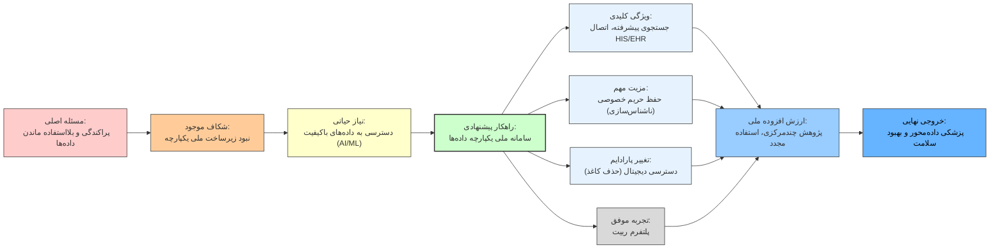

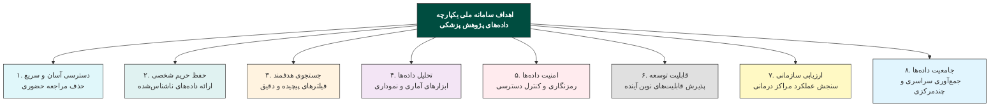

# بیان مسئله

مسئله اصلی، نه کمبود داده، بلکه **عدم مدیریت صحیح داده** است.

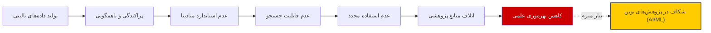

# تحلیل عمیق چالش‌ها
مدیریت داده در دانشگاه‌های علوم پزشکی یک مشکل تک‌بعدی نیست؛ این چالش دارای لایه‌های مختلفی است که باید در راهکار نهایی در نظر گرفته شوند:

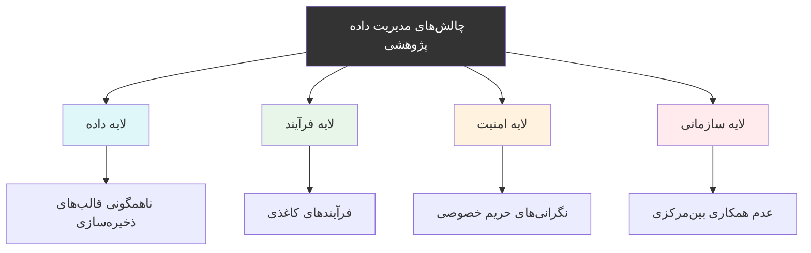

# راهکار پیشنهادی
برای برون‌رفت از این چالش‌ها، طراحی و استقرار «سامانه ملی یکپارچه داده‌های پژوهش پزشکی» به عنوان زیرساخت متمرکز، امن و هوشمند پیشنهاد می‌شود. این سامانه با تغییر پارادایم از «فرآیندهای کاغذی» به «دسترسی دیجیتال هوشمند»، شکاف موجود را پر می‌کند.

# اهداف و ویژگی‌های کلیدی سامانه
این سامانه با تکیه بر قابلیت‌های فنی پیشرفته، اهداف راهبردی زیر را دنبال می‌کند:

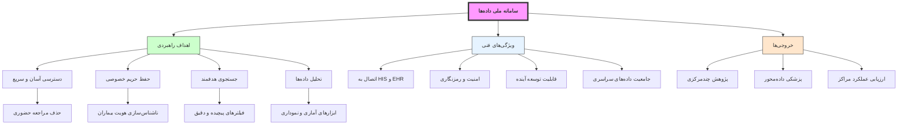

# ذی‌نفعان و موارد کاربرد
اصلی‌ترین ذی‌نفعان این سامانه عبارتند از: دانشجویان و پژوهشگران پزشکی (تهیه‌کنندگان و مصرف‌کنندگان داده)، اساتید و دانشگاه‌ها، وزارت بهداشت، کمیته‌های اخلاق پژوهش، و نهادهای قانونی. موارد کاربرد شامل:

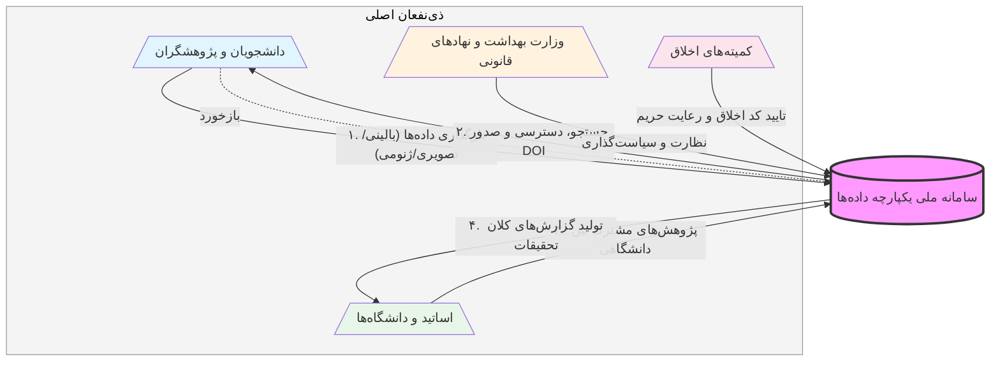

<a href="https://en.wikipedia.org/wiki/Data_governance" style="text-decoration:none; color:green;" target="_blank">
<strong>
حاکمیت داده
</strong>
    </a>

## 🧩 مرحله ۳: تعریف دقیق راه‌حل (Solution Architecture Thinking)

راه‌حل پیشنهادی یک **پلتفرم متمرکز مدیریت داده** است که سه قابلیت کلیدی را فراهم می‌کند:

1. مدیریت داده (Data Management)  
2. حاکمیت داده (Data Governance)  
3. بهره‌برداری پژوهشی (Research Utilization)  

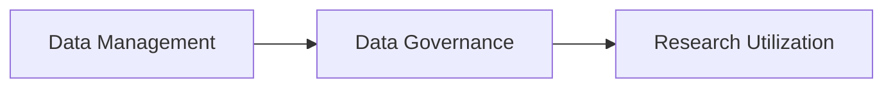

۱. مدیریت داده (Data Management)

شامل:

ایجاد Dataset
ذخیره‌سازی فایل
تعریف متادیتا
جستجو و بازیابی

📌 تعریف:
Dataset = مجموعه‌ای از داده‌ها که برای یک هدف مشخص جمع‌آوری شده‌اند

۲. حاکمیت داده (Data Governance)

شامل:

تعیین مالک داده
تعیین سطح دسترسی
ثبت فعالیت‌ها

📌 تعریف:
Access Control (کنترل دسترسی) = تعیین اینکه چه کسی به چه داده‌ای دسترسی دارد

۳. بهره‌برداری پژوهشی

شامل:

تعریف Challenge
ارزیابی مدل‌ها
تولید دانش

📌 تعریف:
Machine Learning (یادگیری ماشین) = الگوریتم‌هایی که از داده یاد می‌گیرند

## معماری فنی سیستم (تحلیل دقیق)

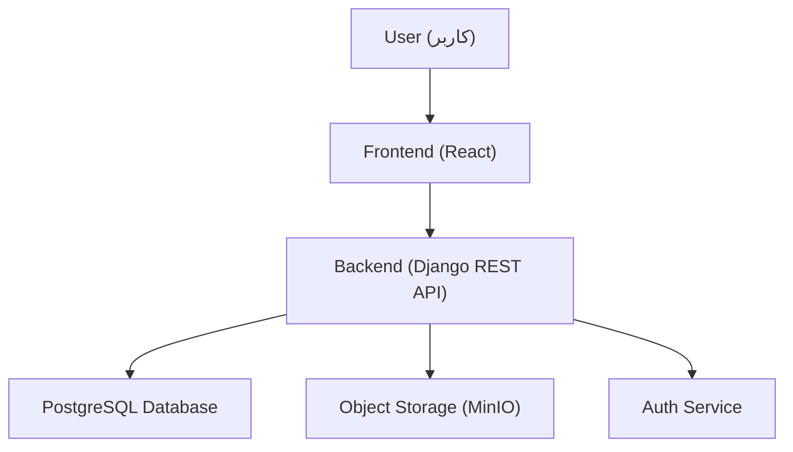

۱. Frontend

📌 تعریف:
React = کتابخانه JavaScript برای ساخت رابط کاربری
https://react.dev/

وظایف:

نمایش داده‌ها
ارسال درخواست به Backend
مدیریت UI

۲. Backend

📌 تعریف:
Django = فریمورک Python برای توسعه وب
https://www.djangoproject.com/

📌 تعریف:
REST API (Representational State Transfer)
= استانداردی برای ارتباط بین سیستم‌ها
https://en.wikipedia.org/wiki/REST

وظایف:

مدیریت منطق سیستم
کنترل دسترسی
پردازش درخواست‌ها

۳. پایگاه داده

📌 تعریف:
PostgreSQL = سیستم مدیریت پایگاه داده رابطه‌ای
https://www.postgresql.org/

وظیفه:

ذخیره metadata
ذخیره روابط

۴. Object Storage

📌 تعریف:
MinIO = سیستم ذخیره‌سازی سازگار با S3
https://min.io/

📌 تعریف:
S3 (Simple Storage Service)
= استاندارد ذخیره‌سازی شیء
https://en.wikipedia.org/wiki/Amazon_S3

وظیفه:

ذخیره فایل‌های حجیم
جداسازی فایل از دیتابیس

## 🧩 مرحله ۵: امنیت (سطح حرفه‌ای پزشکی)

## امنیت داده‌های پزشکی

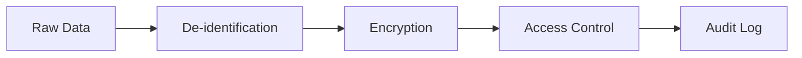

۱. ناشناس‌سازی

📌 تعریف:
De-identification
= حذف اطلاعات هویتی از داده

مثال:

حذف نام
حذف کد ملی

۲. رمزنگاری

📌 تعریف:
Encryption (رمزنگاری)
= تبدیل داده به فرم غیرقابل خواندن

انواع:

At Rest (در ذخیره)
In Transit (در انتقال)

۳. کنترل دسترسی

📌 تعریف:
RBAC (Role-Based Access Control)
= کنترل دسترسی مبتنی بر نقش
https://en.wikipedia.org/wiki/Role-based_access_control

۴. ثبت لاگ

📌 تعریف:
Audit Log
= ثبت تمام فعالیت‌ها برای بررسی امنیت

## نسخه‌بندی داده‌ها (Dataset Versioning)

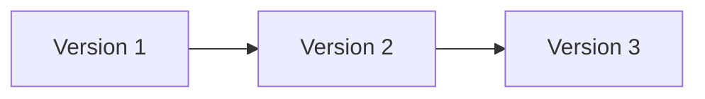

تعریف:

Versioning
= نگهداری نسخه‌های مختلف یک Dataset در طول زمان

ویژگی‌های سیستم:
هر نسخه immutable (غیرقابل تغییر)
امکان بازگشت (Rollback)
ثبت تغییرات

📌 تعریف:
Immutable = غیرقابل تغییر

مزیت:
reproducibility (تکرارپذیری پژوهش)

📌 تعریف:
Reproducibility
= امکان تکرار یک آزمایش با همان نتایج

## نمونه‌های مشابه در دنیا

این سامانه با الهام از چند پلتفرم مطرح بین‌المللی طراحی شده است که هرکدام بخشی از نیازهای مدیریت و بهره‌برداری از داده‌های پژوهشی و پزشکی را پوشش می‌دهند. در ادامه، این سیستم‌ها به‌صورت دقیق معرفی می‌شوند:

---

### ۱. 
<a href="https://www.kaggle.com/datasets" style="text-decoration:none; color:green;" target="_blank">
<strong>
Kaggle
</strong>
</a>

Kaggle یکی از بزرگ‌ترین پلتفرم‌های علم داده در جهان است که امکان انتشار، اشتراک‌گذاری و تحلیل Datasetها را برای پژوهشگران فراهم می‌کند.

ویژگی‌های کلیدی:

- ارائه Datasetهای عمومی در حوزه‌های مختلف  
- تعریف مسابقات (Challenge) برای حل مسائل واقعی  
- وجود Leaderboard برای ارزیابی عملکرد مدل‌ها  
- ایجاد جامعه‌ای فعال از پژوهشگران و دانشجویان  

📌 نکته مهم:  
این پلتفرم تمرکز اصلی بر داده‌های عمومی دارد و فاقد سازوکارهای پیشرفته برای مدیریت داده‌های حساس (مانند داده‌های پزشکی) است.

---

### ۲. 
<a href="https://www.dhis2.org" style="text-decoration:none; color:green;" target="_blank">
<strong>
DHIS2 (District Health Information Software 2)
</strong>
</a>

DHIS2 یک سیستم متن‌باز و در مقیاس ملی برای مدیریت داده‌های سلامت است که در بسیاری از کشورها برای جمع‌آوری، تحلیل و گزارش‌دهی داده‌های بهداشتی استفاده می‌شود.

ویژگی‌های کلیدی:

- جمع‌آوری داده‌های سلامت از مراکز درمانی  
- داشبوردهای تحلیلی برای سیاست‌گذاری  
- پشتیبانی از مقیاس ملی و سازمانی  
- مدیریت داده‌های ساختاریافته سلامت  

📌 نکته مهم:  
این سیستم بیشتر بر **گزارش‌گیری و تحلیل مدیریتی** تمرکز دارد و امکاناتی مانند Challenge یا توسعه مدل‌های هوش مصنوعی را به‌صورت مستقیم ارائه نمی‌دهد.

---

### ۳. 
<a href="https://galaxyproject.org" style="text-decoration:none; color:green;" target="_blank">
<strong>
Galaxy Platform
</strong>
</a>

Galaxy یک پلتفرم متن‌باز در حوزه زیست‌محاسباتی (Bioinformatics) است که برای تحلیل داده‌های علمی و تضمین تکرارپذیری پژوهش‌ها طراحی شده است.

ویژگی‌های کلیدی:

- اجرای workflowهای پژوهشی  
- مدیریت داده‌های علمی  
- تضمین reproducibility (تکرارپذیری نتایج)  
- محیط کاربرپسند برای تحلیل داده  

📌 تعریف:
**Reproducibility (تکرارپذیری)** = امکان اجرای مجدد یک آزمایش و دستیابی به نتایج مشابه  

📌 نکته مهم:  
Galaxy بیشتر بر **تحلیل داده و workflow پژوهشی** تمرکز دارد و کمتر به مدیریت جامع Dataset و کنترل دسترسی سازمانی می‌پردازد.

---

### جمع‌بندی مقایسه‌ای

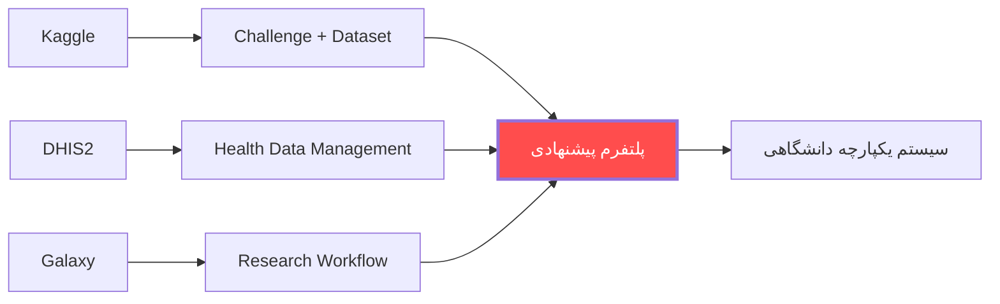

ما از Kaggle قابلیت Dataset و Challenge را می‌گیریم،
از DHIS2 مدیریت داده‌های سلامت را،
و از Galaxy مدیریت فرآیند پژوهش را،
و همه را در یک پلتفرم یکپارچه دانشگاهی ترکیب می‌کنیم.

---

# 🧩 فاز اجرایی پروژه (Execution Plan)

هدف این بخش، تبدیل طرح مفهومی به یک برنامه عملیاتی با **تقسیم وظایف شفاف، زمان‌بندی مشخص و خروجی قابل ارزیابی** است.

---

# ساختار تیم‌ها

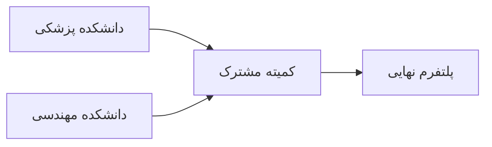

۱. تیم دانشکده پزشکی (Medical Team)

نقش: مالک داده و تعریف‌ کننده نیاز

مسئولیت‌ها:

شناسایی منابع داده (بیمارستان‌ها، کلینیک‌ها، آزمایشگاه‌ها)
تعریف ساختار داده‌های بالینی
تعیین سطح حساسیت داده‌ها
مشارکت در تدوین سیاست‌های حاکمیت داده
اعتبارسنجی علمی داده‌ها

📌 خروجی‌ها (Deliverables):

لیست Datasetهای اولویت‌دار
تعریف Data Dictionary
سند سیاست‌های دسترسی (Access Policy)
تأیید کیفیت داده‌ها

۲. تیم دانشکده مهندسی (Engineering Team)

نقش: طراح و پیاده‌ساز سیستم

مسئولیت‌ها:

طراحی معماری سیستم
توسعه Backend و API
توسعه Frontend
پیاده‌سازی ذخیره‌سازی داده
پیاده‌سازی امنیت (Encryption / RBAC)
استقرار سیستم (Deployment)

📌 خروجی‌ها:

نسخه اولیه پلتفرم (MVP)
API مستند شده
سیستم احراز هویت
داشبورد مدیریت داده
۳. کمیته مشترک (Joint Committee)

نقش: تصمیم‌گیری و هم‌راستاسازی

اعضا:

نماینده معاونت پژوهشی
نماینده IT
نماینده حقوقی/اخلاق پزشکی
نماینده مهندسی

مسئولیت‌ها:

حل تعارض‌ها

تصویب سیاست‌ها

نظارت بر پیشرفت پروژه

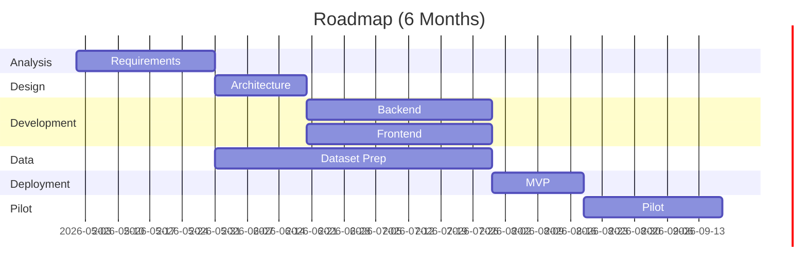

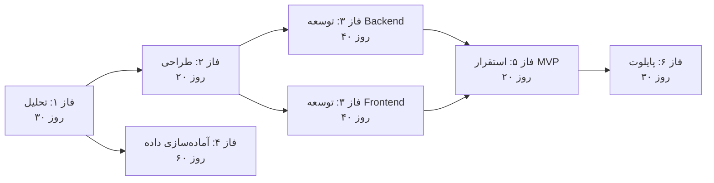

📍 شرح فازها
فاز ۱: تحلیل (ماه ۱)

خروجی:

مستند نیازمندی‌ها (Requirement Document)
شناسایی Datasetهای اولیه

مسئول اصلی: دانشکاه پزشکی

فاز ۲: طراحی (ماه ۲)

خروجی:

طراحی معماری سیستم
طراحی مدل داده

مسئول اصلی: دانشکده مهندسی

فاز ۳: توسعه (ماه ۳ و ۴)

خروجی:

نسخه MVP سیستم

مسئول: مهندسی + بازخورد پزشکی

فاز ۴: آماده‌سازی داده (همزمان با توسعه)

خروجی:

Datasetهای تمیز، ناشناس‌سازی شده و استاندارد

مسئول: دانشکاه پزشکی

فاز ۵: استقرار (ماه ۵)

خروجی:

سیستم عملیاتی در محیط واقعی

مسئول: مهندسی

فاز ۶: پایلوت (ماه ۶)

خروجی:

اجرای واقعی روی یک یا دو Dataset
گزارش عملکرد

مسئول: مشترک

🎯 شاخص‌های موفقیت (KPIs)

برای جلوگیری از کلی‌گویی، موفقیت پروژه با شاخص‌های زیر سنجیده می‌شود:

تعداد Datasetهای ثبت‌شده
تعداد کاربران فعال
تعداد پروژه‌های پژوهشی مبتنی بر داده
زمان دسترسی به داده (کاهش یافته)
میزان استفاده مجدد از داده‌ها

## ⚠️ ریسک‌ها و راهکارها

| ریسک              | توضیح                         | راهکار                        |
| ----------------- | ----------------------------- | ----------------------------- |
| مقاومت سازمانی    | عدم تمایل به اشتراک داده      | تعریف مشوق‌های پژوهشی          |
| نگرانی امنیتی     | ترس از افشای داده             | پیاده‌سازی RBAC و Audit Log    |
| کیفیت پایین داده  | داده‌های ناقص یا ناسازگار      | تعریف فرآیند کنترل کیفیت (QC) |
| عدم هماهنگی تیم‌ها | اختلاف بین تیم پزشکی و مهندسی | تشکیل و فعال‌سازی کمیته مشترک  |