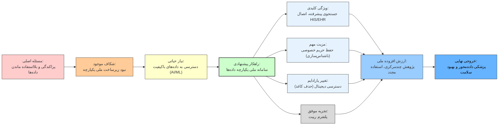
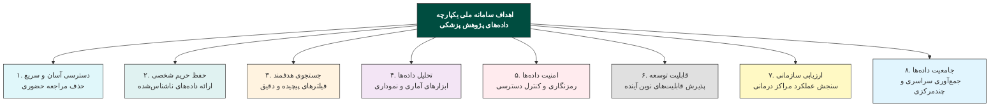
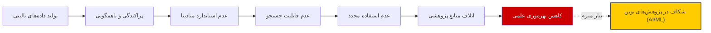
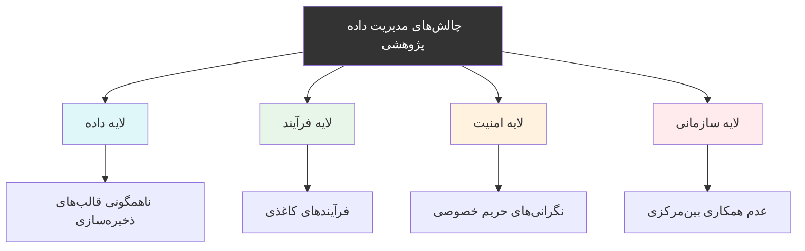
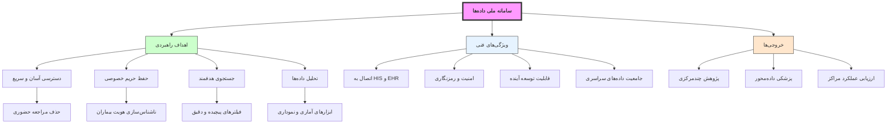
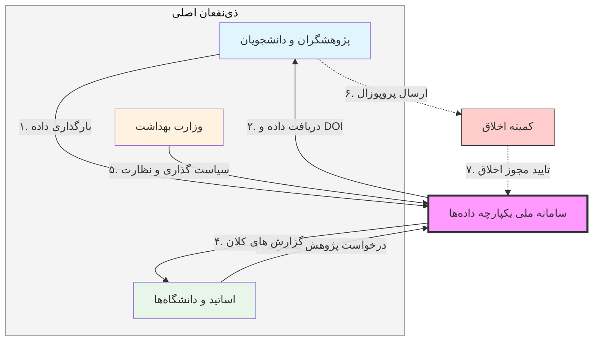
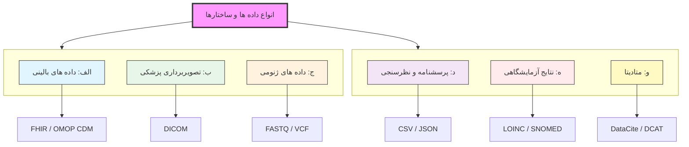
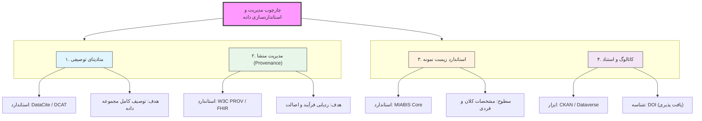

# مقدمه و چکیده

در سال‌های اخیر، نظام پژوهش پزشکی در ایران شاهد تولید حجم قابل‌توجهی از داده‌های ارزشمند توسط دانشجویان، مراکز تحقیقاتی و دانشگاه‌های علوم پزشکی بوده است. با این حال، به‌دلیل نبود یک زیرساخت ملی یکپارچه، این داده‌ها غالباً به‌صورت پراکنده، ناهمگون و غیرقابل‌اشتراک باقی می‌مانند و در عمل، بخش قابل‌توجهی از ظرفیت علمی کشور بلااستفاده می‌ماند. این چالش، به‌ویژه در عصر توسعه روش‌های داده‌محور در پزشکی—از جمله یادگیری ماشین، یادگیری عمیق، پردازش تصویر پزشکی و تحلیل سیگنال‌های زیستی—اهمیت دوچندان یافته است؛ چراکه پیشرفت در این حوزه‌ها مستقیماً وابسته به دسترسی به داده‌های باکیفیت، ساختاریافته و قابل استفاده مجدد است.

در وضعیت فعلی، داده‌های پژوهشی حاصل از پایان‌نامه‌ها، کارآزمایی‌های بالینی و مطالعات دانشگاهی، علاوه بر پراکندگی، در قالب‌های غیرهمگن و بعضاً غیراستاندارد ذخیره می‌شوند. این مسئله نه‌تنها امکان تجمیع و مقایسه داده‌ها را محدود می‌کند، بلکه مانع از شکل‌گیری پژوهش‌های چندمرکزی و تحلیل‌های کلان‌داده در سطح ملی می‌شود. تجربه‌های موفق داخلی نیز نشان داده‌اند که حرکت به‌سوی دیجیتالی‌سازی و یکپارچه‌سازی داده‌ها، نقش مؤثری در ارتقای کیفیت پژوهش ایفا می‌کند.

در همین راستا، این سامانه می‌تواند پژوهش‌های دانشگاهی را از «فرآیندهای کاغذی و ابزارهای جزیره‌ای» رها سازد و با ایجاد یک زیرساخت یکپارچه، امکان بهره‌گیری نظام‌مند از تجارب پیشین را فراهم آورد. به‌عنوان نمونه، پلتفرم «ربیت» در دانشگاه شهید بهشتی طی پنج سال گذشته موفق به دیجیتالی‌سازی بیش از ۳۰۰ پروژه پژوهشی و یکپارچه‌سازی فرم‌های پزشکی شده است؛ تجربه‌ای که نشان‌دهنده ظرفیت بالای چنین رویکردهایی در سطح ملی است.

بر این اساس، هدف از طراحی و استقرار «سامانه ملی یکپارچه داده‌های پژوهش پزشکی»، ایجاد بستری متمرکز، امن و هوشمند برای گردآوری، استانداردسازی و به‌اشتراک‌گذاری داده‌های پژوهشی در کشور است. این سامانه با فراهم‌سازی یک موتور جستجوی پیشرفته و رابط کاربری کارآمد، به پژوهشگران امکان می‌دهد داده‌های مورد نیاز خود را بر اساس معیارهای هدفمند جستجو و استخراج کنند. اتصال به سامانه‌های اطلاعات بیمارستانی (HIS) و پرونده الکترونیک سلامت (EHR)، در کنار به‌کارگیری الگوریتم‌های پیشرفته بازیابی اطلاعات، زمینه دسترسی سریع، دقیق و هدفمند به داده‌ها را فراهم می‌سازد.

از منظر حاکمیت داده و ملاحظات اخلاقی، این سامانه با بهره‌گیری از سازوکارهای کدگذاری و ناشناس‌سازی، حریم خصوصی بیماران را به‌طور کامل حفظ می‌کند. برخلاف رویه‌های سنتی که در آن‌ها دسترسی به داده‌ها با اطلاعات هویتی همراه بود، در این سامانه پس از تأیید کد اخلاق، صرفاً داده‌های مورد نیاز به‌صورت غیرقابل‌شناسایی در اختیار پژوهشگر قرار می‌گیرد. همچنین، با حذف فرآیندهای زمان‌بر حضوری و جایگزینی آن با دسترسی برخط، کارایی و سرعت انجام پژوهش‌ها به‌طور چشمگیری افزایش می‌یابد.

چشم‌انداز این سامانه، ارتقای کیفیت و اثربخشی پژوهش‌های پزشکی، تقویت تعامل و هم‌افزایی میان دانشگاه‌ها و مراکز تحقیقاتی، تسریع تولید علم مبتنی بر داده، و در نهایت، کمک به بهبود نظام سلامت و ارتقای سلامت عمومی در کشور است.

## 🔷 نکات کلیدی

* **مسئله اصلی:** پراکندگی و بلااستفاده ماندن داده‌های پژوهش پزشکی در کشور
* **نیاز حیاتی:** دسترسی به داده‌های باکیفیت و ساختاریافته برای پژوهش‌های نوین (AI، ML، پردازش تصویر پزشکی)
* **شکاف موجود:** نبود زیرساخت ملی یکپارچه برای تجمیع و اشتراک داده‌ها
* **راهکار پیشنهادی:** طراحی «سامانه ملی یکپارچه داده‌های پژوهش پزشکی»
* **ویژگی کلیدی سامانه:**
  * موتور جستجوی پیشرفته و هدفمند
  * اتصال به HIS و EHR
  * دسترسی سریع و آنلاین به داده‌ها
* **مزیت مهم:** حفظ کامل حریم خصوصی با ناشناس‌سازی داده‌ها
* **تغییر پارادایم:** حذف فرآیندهای حضوری و کاغذی → دسترسی دیجیتال و هوشمند
* **تجربه های داخلی:**
  * <a href="https://rabit.ir/" style="text-decoration:none; color:green;" target="_blank">
      <strong> پلتفرم ربیت</strong>
    </a>
  * دیجیتالی‌سازی بیش از ۳۰۰ پروژه در دانشگاه شهید بهشتی
    * <a href="https://irancohorts.ir/?lang=fa" style="text-decoration:none; color:green;" target="_blank">
      <strong>  پرشین کوهورت</strong>
    </a>
* <a href="https://v-research.mums.ac.ir/index.php/component/content/article/43-persian-category/1319-mums-persian-cohort/" style="text-decoration:none; color:blue;" target="_blank">
      <strong> کوهورت دانشگاه علوم پزشکی مشهد و دیگر شهرها</strong>
    </a>
* **ارزش افزوده ملی:**
  * امکان پژوهش‌های چندمرکزی
  * افزایش کیفیت و سرعت تولید علم
  * بهره‌برداری مجدد از داده‌ها
* **خروجی نهایی:** حرکت به سمت پزشکی داده‌محور و بهبود نظام سلامت کشور

# بیان مسئله

مسئله اصلی، نه کمبود داده، بلکه **عدم مدیریت صحیح داده** است.

# تحلیل عمیق چالش‌ها
مدیریت داده در دانشگاه‌های علوم پزشکی یک مشکل تک‌بعدی نیست؛ این چالش دارای لایه‌های مختلفی است که باید در راهکار نهایی در نظر گرفته شوند:

# راهکار پیشنهادی
برای برون‌رفت از این چالش‌ها، طراحی و استقرار «سامانه ملی یکپارچه داده‌های پژوهش پزشکی» به عنوان زیرساخت متمرکز، امن و هوشمند پیشنهاد می‌شود. این سامانه با تغییر پارادایم از «فرآیندهای کاغذی» به «دسترسی دیجیتال هوشمند»، شکاف موجود را پر می‌کند.

# اهداف و ویژگی‌های کلیدی سامانه
این سامانه با تکیه بر قابلیت‌های فنی پیشرفته، اهداف راهبردی زیر را دنبال می‌کند:

# ذی‌نفعان و موارد کاربرد
اصلی‌ترین ذی‌نفعان این سامانه عبارتند از: دانشجویان و پژوهشگران پزشکی (تهیه‌کنندگان و مصرف‌کنندگان داده)، اساتید و دانشگاه‌ها، وزارت بهداشت، کمیته‌های اخلاق پژوهش، و نهادهای قانونی. موارد کاربرد شامل:

# انواع داده‌ها و ساختارها

# جدول استانداردها و واژه‌نامه‌های داده‌های سلامت

برای اطمینان از سازگاری و قابلیت تبادل داده‌ها، استانداردهای زیر باید رعایت شوند:

| استاندارد / واژه‌نامه | دامنه / نوع داده        | توضیحات عمده                                                                                                                                                                                   |
| :------------------- | :---------------------- | :--------------------------------------------------------------------------------------------------------------------------------------------------------------------------------------------- |
| HL7 FHIR             | داده‌های بالینی          | استاندارد اکسچینج RESTful برای داده‌های سلامت؛ منابع (Resources) مانند Patient, Observation, Encounter, Condition, Procedure, Medication. رایج‌ترین استاندارد تعامل‌پذیری نوین در سیستم‌های سلامت. |
| DICOM                | تصاویر پزشکی            | استاندارد بین‌المللی برای فرمت و تبادل تصاویر (CT/MRI/X-ray) و متادیتای آنها. پشتیبانی از DICOMweb برای دسترسی REST-based.                                                                      |
| ISO 13606 / OpenEHR  | پرونده الکترونیک سلامت  | استاندارد دو-مدل برای تبادل EHR. در مطالعه‌های ایرانی به‌عنوان چارچوب مرجع EHR توصیه شده است.                                                                                                    |
| OMOP CDM             | داده‌های مشاهده‌ای بالینی | مدل داده مشترک جامعه OHDSI برای یکسان‌سازی ساختار داده‌های بزرگ بالینی و تحلیل‌های مقیاس‌پذیر. واژه‌نامه‌های متناظر (SNOMED, RxNorm, LOINC) برای یکسان‌سازی مفاهیم استفاده می‌شوند.                    |
| MIABIS               | متادیتای زیست‌نمونه‌ها    | استاندارد حداقلی اطلاعات برای توصیف بانک‌های زیستی و مجموعه‌های نمونه در سطح کلان. شامل ویژگی‌های biobank، collection، donor و sample.                                                            |
| ICD-10/11            | تشخیص‌های بیماری         | طبقه‌بندی بین‌المللی بیماری‌ها برای کدگذاری تشخیص‌ها (مثلاً در منابع FHIR Condition یا جدول OMOP). ICD-11 از سال ۲۰۲۲ رسماً جایگزین شده است.                                                         |
| SNOMED CT            | مفاهیم بالینی           | مجموعه جامع برای توصیف علائم، بیماری‌ها، فرایندها و سایر مفاهیم بالینی. در صورت دسترسی، برای دقت معنایی و تعامل‌پذیری بالاتر مفید است.                                                           |
| LOINC                | آزمون‌های آزمایشگاهی     | شناسه‌های استاندارد برای نام‌گذاری تست‌های آزمایشگاهی و نتایج آنها (مثلاً در FHIR Observation یا OMOP Measurement).                                                                                |
| FAIR Principles      | کلیت مدیریت داده        | اصول هدایتگر علمی: Findable (قابل یافت)، Accessible (قابل دسترسی)، Interoperable (سازگار)، Reusable (قابل‌استفاده‌ی مجدد). برای داده و ابزار معتبر است.                                          |

# مدل‌های فراداده و ره‌گیری منشاء

#  ناشناس‌سازی و ارزیابی ریسک شناسایی مجدد

برای حفظ حریم خصوصی افراد، داده‌های حساس باید پیش از اشتراک امن شوند. روش‌های ناشناس‌سازی متنوع است:

## K-گمنامی (k-Anonymity)
داده‌ها با کلیدواژه‌های شناسایی (مثل سن، جنس، کد پستی) گروه‌بندی و تعمیم می‌یابند تا هر رکورد حداقل با k-1 نفر دیگر همگروه شود. این روش ساده است اما در صورت تغییرپذیری بالا (داده‌های نادر) ناکارآمد می‌شود.
## حریم خصوصی تفاضلی (Differential Privacy)
افزودن نویز تصادفی به نتایج پرس‌وجو یا آمارهای خروجی جهت مخفی‌کردن داده‌های فردی. این رویکرد تضمین ریاضیاتی می‌دهد اما به محاسبات پیچیده نیاز دارد و ممکن است تحلیل را مختل کند.
## پارسونیم‌سازی و هویت‌زدایی (Pseudonymization)
جایگزینی شناسه‌ها با کدهای تصادفی و جداسازی اطلاعات هویتی از داده‌های موضوعی. این روش سادگی اجرا و حفظ ارتباط رکوردها را دارد اما در صورت داشتن داده کمکی قابل برگشت است.
## قوانین Safe Harbor
حذف صریح چندین فیلد شناساگر طبق استانداردهایی مانند HIPAA (مثلاً نام، شماره ملی، محل دقیق، تاریخ تولد کامل، شماره تلفن، ایمیل). این روش مبتنی بر چک‌لیست است و اجرای آن نسبتاً ساده است.

هر روش مزایا و معایب خود را دارد. بنابراین پیش از انتشار داده‌ها باید خطر بازشناسایی (با سناریوهایی مثل پیوند با پایگاه‌های عمومی) توسط آزمون‌های آماری یا ابزارهای تحلیل ارزیابی شود. اسناد علمی و تجربی نشان می‌دهند رعایت اصول «حداقل‌دسترسی» و ناشناس‌سازی مبتنی بر ریسک، رکن اساسی اشتراک ایمن داده‌های پزشکی است.

# ملاحظات حقوقی، اخلاقی و حریم خصوصی در ایران

## قوانین حریم خصوصی در ایران
- ایران فاقد قانون جامع حفاظت از داده‌ها است
- قوانین پراکنده موجود شامل:
  - قانون تجارت الکترونیک: اطلاعات سلامت به عنوان «اطلاعات حساس» تعریف شده است
  - منشور حقوق شهروندی (۱۳۹۶)
  - الزام اخذ مجوز از کمیته اخلاق برای پژوهش‌های پزشکی

## مدل‌های رضایت
- عمدتاً «رضایت آگاهانه کتبی و موردی» استفاده می‌شود
- در مطالعات بزرگ مانند PERSIAN از «رضایت عام» برای استفاده‌های ثانویه استفاده می‌شود
- پیش‌فرض: نیاز به مجوز IRB و حذف یا رمزنگاری داده‌های هویتی

## انتقال داده به خارج کشور
- مقررات صریحی وجود ندارد
- داده‌های سلامت «بسیار حساس» تلقی می‌شوند
- هرگونه انتقال برون‌مرزی نیازمند مجوز از مراجع ذی‌صلاح (مانند شورای عالی فضای مجازی یا وزارتخانه‌ها) است

---

# امنیت، کنترل دسترسی و میزبانی

## الزامات امنیتی فنی
- رمزنگاری در حین انتقال (TLS/SSL)
- رمزنگاری در حال سکون (AES-256)
- کنترل دسترسی مبتنی بر نقش (RBAC)
- احراز هویت قوی (SSO)
- لاگینگ جامع (Audit log)
- استراتژی دفاع در عمق
- استانداردهای ISO/IEC 27001, 27017

## مقایسه میزبانی (امنیت و پایداری داده)

### میزبانی سازمانی (On-Premise)
- کنترل فیزیکی کامل
- مالکیت داده
- نیاز به سخت‌افزار اضافی برای مقیاس‌پذیری
- هزینه اولیه بالا
- وابستگی به زیرساخت داخلی برای تداوم سرویس

### میزبانی ابر داخلی (Cloud)
- افزایش پویای منابع (مقیاس‌پذیری)
- هزینه اشتراکی
- مدیریت آسان‌تر
- نیاز به اطمینان از ارائه‌دهنده داخلی

> **نکته مهم:** به دلیل تحریم‌ها، **ابر ملی یا دیتاسنتر دانشگاهی اولویت دارد.**

## اصل ۳-۲-۱ پشتیبان‌گیری (ضامن عدم از دست رفتن داده)
- **۳** نسخه پشتیبان
- در **۲** نوع رسانه متفاوت
- **۱** نسخه برون‌سازمانی (off-site)

> بازیابی کامل حتی پس از فاجعه فیزیکی یا سایبری امکان‌پذیر است.

## مطالعه PERSIAN Cohort (الگوی عملی)
- معماری **on-premise سه‌لایه**:
  - پایگاه داده MSSQL
  - سرور اپلیکیشن
  - ذخیره‌سازی سرد آنهیلز (برای زیست‌نمونه‌ها)
- اقدامات امنیتی:
  - فایروال سخت‌افزاری
  - **بکاپ‌های چندگانه**
  - کدگذاری افراد با شناسه یکتا

## پیشنهاد معماری ترکیبی برای سامانه ملی
- **داده‌های فوق‌حساس** ← دیتاسنتر داخلی
- **خدمات عمومی‌تر** (تحلیل کلان داده، بکاپ افزونه) ← ابر خصوصی داخلی
- **هدف:** حفظ امنیت و جلوگیری از گم شدن داده‌های بحرانی

---

# حکمرانی داده و پایداری

## ساختار مدیریتی (Governance)

### نقش‌ها
- مالک داده (Data Owner)
- متولی داده (Data Steward)
- مدیر سیستم

### سیاست‌ها
- تعیین زمان، مکان و نحوه اشتراک‌گذاری داده

### فرایندها
- تأیید درخواست داده
- رسیدگی به تخلفات
- بروزرسانی مقررات

### کمیته نظارت
- نمایندگان وزارت بهداشت
- دانشگاه‌ها
- متخصصان IT

## مدیریت رضایت (Consent Management)
- ثبت نحوه و دامنه رضایت هر مشارکت‌کننده (سیستم مبتنی بر پروفایل)

### انواع رضایت
- رضایت برای پروژه خاص
- رضایت عام برای پژوهش‌های مشابه
- حق بازپس‌گیری رضایت در هر زمان

## مدل‌های تأمین مالی و پایداری

مدل ترکیبی پیشنهادی:

- **بودجه دولتی:** وزارت بهداشت / وزارت علوم
- **حمایت دانشگاهی:** تأمین زیرساخت
- **خدمات سفارشی:** نگهداری داده اختصاصی برای پروژه‌ها با هزینه دریافتی
- **انگیزه غیرمالی:** امتیازات پژوهشی، گواهی‌های درون‌سامانه برای دانشجویان

---

# فاز اجرایی پروژه (Execution Plan)

هدف این بخش، تبدیل طرح مفهومی به یک برنامه عملیاتی با **تقسیم وظایف شفاف، زمان‌بندی مشخص و خروجی قابل ارزیابی** است.

## عنوان طرح
«طراحی و پیاده‌سازی سامانه ملی مدیریت و اشتراک‌گذاری داده‌های پزشکی با رویکرد مرحله‌ای و تأکید بر حریم خصوصی، امنیت و حاکمیت داده»

## ایده اصلی
شروع با داده‌های ساده و کم‌ریسک (آزمایشگاهی، پرسشنامه) ← توسعه تدریجی به داده‌های بالینی، تصویری و ژنومی

## استانداردهای مورد استفاده
FHIR، DICOM، OMOP و سایر استانداردهای بین‌المللی

## معماری پیشنهادی
مقیاس‌پذیر با API، ETL، ذخیره‌سازی ترکیبی (ابر داخلی + on-premise)

## حریم خصوصی
توجه جدی به ناشناس‌سازی، رمزنگاری، کنترل دسترسی (RBAC)، رضایت‌محوری

## ساختار اجرایی (تیم‌ها)

### تیم پزشکی
تعریف داده و اعتبار علمی

### تیم مهندسی
طراحی و پیاده‌سازی

### کمیته مشترک
سیاست‌گذاری و حل تعارض

## زمان‌بندی
- کل پروژه: حدود **۳۰ ماه**
- پایلوت اولیه (MVP): حدود **۶ ماه**

## معیارهای موفقیت
- کیفیت و کامل بودن داده‌ها
- عملکرد سیستم (API، دسترس‌پذیری)
- میزان استفاده پژوهشی از داده‌ها

## رویکرد کلی
**چهار فاز مرحله‌ای:** از داده‌های ساده به پیچیده (تصویری و ژنومی) با شاخص‌های کیفیت و پذیرش در هر فاز