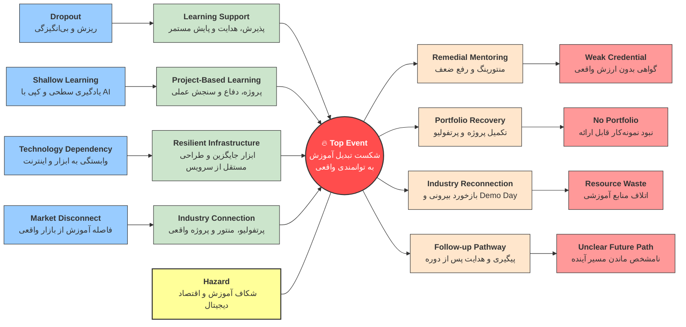
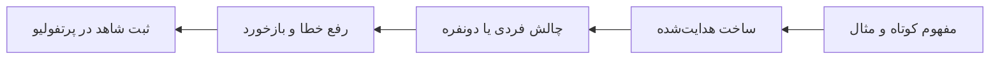
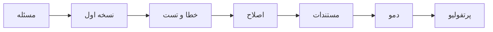
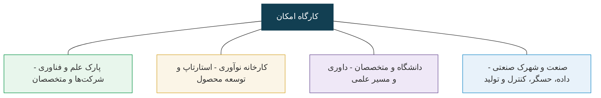
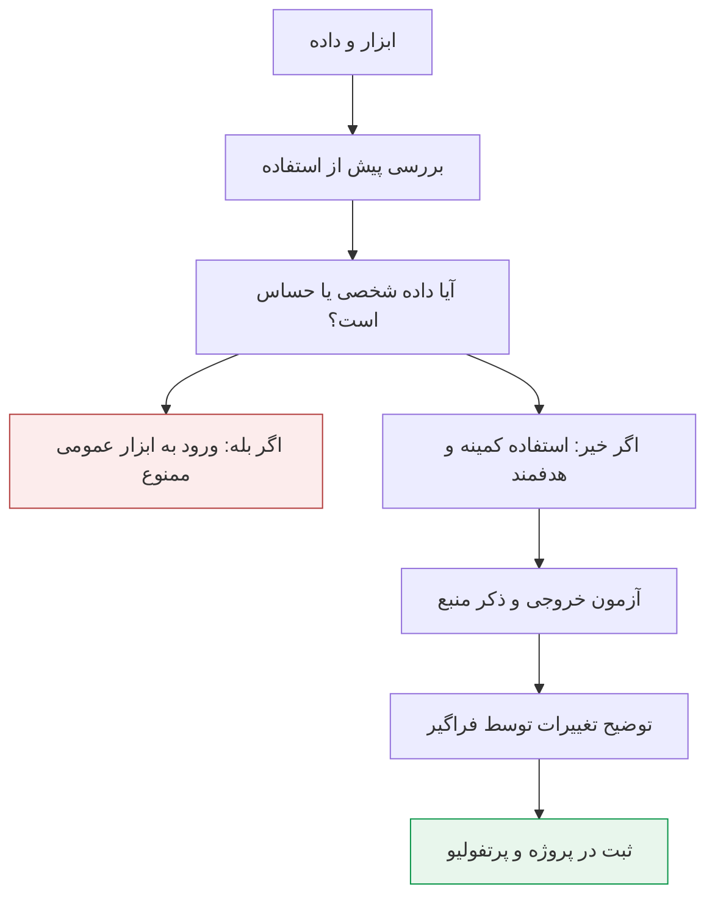
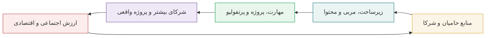

<!-- Mermaid syntax normalized for v9.4.3 compatibility: quoted labels, semicolons, no HTML labels. -->

این صفحه، نسخه **ارائه‌ای و تصمیم‌محور** طرح «امکان» است. سند مرجع همچنان کتابچه امکان‌سنجی نهایی است؛ اما در این صفحه تلاش شده منطق طرح، برنامه سال اول، مسیر آینده، اتصال به زیست‌بوم مشهد، مدل سنجش اثر و تصمیم‌های موردنیاز هیئت‌مدیره بنیاد توسعه خراسان به شکلی مناسب ارائه حضوری جمع‌بندی شود.

> **پیام مرکزی:** هدف، آموزش یک نرم‌افزار یا یک چت‌بات نیست؛ هدف ساختن مسیر پیوسته‌ای است که نوجوان از **یادگیری** به **ساختن**، از ساختن به **نمونه‌کار**، از نمونه‌کار به **تجربه واقعی** و در نهایت به **خلق ارزش** برسد.

  

## تعریف پورتفولیو
مجموعه نمونه‌کارهای قابل ارائه یک فرد.
مثلاً نوجوانی که در این دوره شرکت کرده، در پایان ممکن است پرتفولیوی او شامل این‌ها باشد:
- یک برنامه Python که خودش نوشته است.
- یک پروژه کوچک هوش مصنوعی.
- یک وب‌اپ ساده.
- یک پروژه تحلیل داده.
- فایل توضیح پروژه و نحوه اجرا.
- لینک GitHub پروژه‌ها.
- یک ویدئوی کوتاه از اجرای پروژه.
- توضیح اینکه خودش دقیقاً چه بخشی از کار را انجام داده است.
- شواهد ارتباط با محیط واقعی کار: بازدید، جلسه با شرکت، دریافت مسئله واقعی، بازخورد متخصص یا ارزیابی کارفرما.
      -- نام شرکت یا مجموعه‌ای که تیم با آن تعامل داشته است.
      -- مسئله یا نیاز مطرح‌شده از طرف شرکت.
      -- کاری که تیم ارائه کرده است.
      -- بازخورد شرکت.
      -- اصلاحاتی که پس از بازخورد انجام شده است.
      -- در صورت امکان، تأییدیه، ایمیل، صورت‌جلسه کوتاه یا نظر مکتوب شرکت.

---

# 1. تصمیمی که قرار است گرفته شود

فاز نخست به‌صورت یک **پایلوت یک‌ساله، محدود، قابل سنجش و قابل اصلاح** طراحی شده است:

- ۲۰ نوجوان ۱۴ تا ۱۸ سال؛
- ۱۰ رایانه با کار دونفره، اما پرونده و ارزیابی فردی؛
- دو ترم ۱۶ هفته‌ای؛
- هر هفته دو جلسه دو ساعته؛
- ۱۲۸ ساعت آموزش هدایت‌شده در سال نخست؛
- تمرین، پروژه، بازخورد، راهنمایی تخصصی و ارائه در کنار ساعات کلاس؛
- حداقل ۶ خروجی مستند در پرتفولیو و یک پروژه نهایی برای هر فراگیر.

  

### چرا پایلوت کوچک؟

زیرا در سال اول، هدف اصلی «بزرگ‌شدن» نیست؛ هدف این است که بتوانیم با شواهد واقعی جواب دهیم:

1. آیا فراگیر مهارت قابل مشاهده کسب کرده است؟
2. آیا می‌تواند چیزی بسازد، توضیح دهد و اصلاح کند؟
3. آیا مربی و زیرساخت برای این مدل مناسب بوده‌اند؟
4. آیا اتصال به شرکت، متخصص و مسئله واقعی قابل اجراست؟
5. آیا مدل برای توسعه در سال دوم ارزش دارد؟

---

# 2. چرا اکنون؟ بازار کار در حال جابه‌جایی است

طبق **Future of Jobs Report 2025** مجمع جهانی اقتصاد، تا سال ۲۰۳۰ حدود ۱۷۰ میلیون شغل جدید ایجاد و حدود ۹۲ میلیون شغل جابه‌جا یا حذف می‌شود؛ یعنی مسئله اصلی «پایان کار» نیست، بلکه **تغییر ترکیب کار و مهارت** است. این گزارش همچنین تأکید می‌کند که مهارت‌های فناورانه در کنار تفکر خلاق، تاب‌آوری و انعطاف‌پذیری اهمیت بیشتری پیدا می‌کنند.

گزارش ۲۰۲۵ کنسرسیوم نیروی کار هوش مصنوعی به رهبری Cisco نیز نشان می‌دهد ۷۸٪ نقش‌های فناوری بررسی‌شده شامل مهارت‌های هوش مصنوعی بوده‌اند و ۷ مورد از ۱۰ نقش سریع‌الرشد فناوری، مستقیماً با هوش مصنوعی ارتباط دارند.

  

**نتیجه برای طراحی آموزشی:** برنامه نباید به حفظ یک ابزار یا نوشتن چند پرامپت محدود شود. هسته پایدارتر باید شامل **حل مسئله، برنامه‌نویسی، داده، ساخت محصول، ارتباط، مستندسازی، اخلاق و ایمنی دیجیتال** باشد.

منابع: [World Economic Forum — Future of Jobs 2025](https://www.weforum.org/publications/the-future-of-jobs-report-2025/in-full/2-jobs-outlook/) • [Cisco AI Workforce Consortium 2025](https://newsroom.cisco.com/c/r/newsroom/en/us/a/y2025/ai-workforce-consortium-finds-78-of-ict-roles-now-include-ai-technical-skills-while-human-skills-gain-priority-for-responsible-tech-adoption.html)

---

# 3. نمونه‌های مشابه در جهان چه می‌گویند؟

طرح امکان کپی یک برنامه خارجی نیست، اما سه الگوی معتبر یک پیام مشترک دارند: **یادگیری باید به پروژه، پرتفولیو، راهنمایی تخصصی و فرصت متصل شود.**

  

### UNICEF UPSHIFT

برنامه UPSHIFT برای جوانان ۱۰ تا ۲۴ سال، یادگیری تجربی را با کارگاه، راهنمایی تخصصی و چالش کارآفرینانه ترکیب می‌کند. نوجوان مسئله‌ای را می‌شناسد، راه‌حل می‌سازد و محصول یا خدمت را ارائه می‌کند. این برنامه تا پایان ۲۰۲۵ در بیش از ۵۰ کشور اجرا شده است.

**برداشت برای امکان:** پروژه باید از «صورت مسئله» شروع شود، نه از فهرست دستورات یک نرم‌افزار.

### TUMO

TUMO برای نوجوانان ۱۲ تا ۱۸ سال، خودیادگیری، کارگاه و آزمایشگاه پروژه با متخصصان صنعت را ترکیب می‌کند. خروجی پروژه‌ها در پرتفولیوی شخصی ثبت می‌شود و مسیر هر فرد می‌تواند با علاقه و سرعت یادگیری او تغییر کند.

**برداشت برای امکان:** پرتفولیو می‌تواند «مدرک زنده» فراگیر باشد؛ چیزی که توانایی واقعی را نشان می‌دهد.

### Passport to Earning

برنامه P2E از Generation Unlimited برای جوانان ۱۵ تا ۲۴ سال، آموزش مهارت‌های مرتبط با بازار، گواهی و اتصال به فرصت‌هایی مانند تجربه عملی، کارآموزی، راهنمایی تخصصی و کارآفرینی را در یک مسیر می‌بیند.

**برداشت برای امکان:** گواهی پایان مسیر نیست؛ باید به تجربه و فرصت متصل شود.

منابع: [UNICEF UPSHIFT](https://www.unicef.org/innovation/upshift) • [TUMO Education Model](https://tumo.org/education-program/) • [Generation Unlimited — Passport to Earning](https://www.generationunlimited.org/passport-earning-p2e)

---

# 4. مدل عملیاتی امکان

```mermaid
graph RL;
    A["پذیرش و ارزیابی ورودی"] --> B["یادگیری پایه"];
    B --> C["تمرین و پروژه کوچک"];
    C --> D["پروژه تیمی"];
    D --> E["پرتفولیو و ارائه"];
    E --> F["راهنمایی تخصصی و بازخورد بیرونی"];
    F --> G["تجربه واقعی متناسب با سن"];
    G --> H["مسیر تخصصی، تحصیل، کار یا کارآفرینی"];

    style A fill:#EAF4F3,stroke:#0E6B73;
    style B fill:#EAF4F3,stroke:#0E6B73;
    style C fill:#FBF5E7,stroke:#D6A52B;
    style D fill:#FBF5E7,stroke:#D6A52B;
    style E fill:#E8F6EC,stroke:#079447;
    style F fill:#EFE8F7,stroke:#6A4C93;
    style G fill:#E8F2FA,stroke:#1789C7;
    style H fill:#123F52,stroke:#123F52,color:#ffffff;
```

این زنجیره باعث می‌شود «کلاس» فقط یکی از اجزای سیستم باشد. ارزش اصلی از اتصال چند جزء ایجاد می‌شود: **مربی، پروژه، سنجش، پرتفولیو، شریک بیرونی و پیگیری مسیر فراگیر.**

---

# 5. پذیرش؛ استعدادسنجی برای هدایت، نه حذف

ارزیابی ورودی باید توسط یک **کمیته سه‌نفره پذیرش و هدایت آموزشی** انجام شود: نماینده آموزشی، مربی فنی و فردی با نقش تربیتی/حفاظتی. فرم خام ارزیابی در کتابچه نهایی پیش‌بینی شده و ۶ حوزه را می‌سنجد:

| حوزه                         | امتیاز پیشنهادی |
| ---------------------------- | --------------: |
| مهارت پایه کار با رایانه     |              ۲۰ |
| حل مسئله و تفکر الگوریتمی    |              ۲۵ |
| سرعت یادگیری و انتقال آموخته |              ۲۰ |
| همکاری و ارتباط              |              ۱۵ |
| انگیزه، پشتکار و خودمدیریتی  |              ۱۰ |
| ایمنی و مسئولیت دیجیتال      |              ۱۰ |

**کاربرد نتیجه:** تعیین سطح، نیاز به حمایت آموزشی بیشتر، ترکیب زوج‌ها و انتخاب مسیر؛ نه ساختن برچسب «ضعیف/قوی».

در کنار آن، «میثاق‌نامه یادگیری» از ابتدا روشن می‌کند که هدف فقط حضور یا دریافت گواهی نیست؛ فراگیر مسئول تمرین، صداقت در استفاده از هوش مصنوعی، رعایت حریم خصوصی و مشارکت در کار تیمی است.

---

# 6. زیرساخت فاز اول؛ چرا ۱۰ رایانه می‌تواند کافی باشد؟

فاز اول برای ۲۰ نفر با ۱۰ رایانه طراحی شده است. کار دونفره زمانی مفید است که نقش‌ها در طول جلسه جابه‌جا شوند و هر فرد **حساب، فایل، تمرین و ارزیابی مستقل** داشته باشد.

اولویت خرید در این فاز:

- پردازنده مناسب و پایدار؛
- حافظه RAM کافی؛
- SSD مناسب؛
- شبکه داخلی و اینترنت پایدار؛
- مانیتور و تجهیزات ورودی استاندارد؛
- امکان نصب محیط‌های توسعه و مدل‌های سبک محلی.

**کارت گرافیک مجزا شرط شروع فاز اول نیست.** اگر در سال دوم مسیرهای سنگین‌تر داده/بینایی ماشین اثبات شوند، ارتقا باید بر اساس نیاز واقعی انجام شود.

> اصل طراحی: وابستگی برنامه به یک برند یا سرویس خاص کاهش یابد؛ مهارت باید با ابزارهای مجاز مختلف قابل انتقال باشد.

---

# 7. معماری سال اول

  

## ترم اول؛ پایه مشترک

مسیر از سواد دیجیتال و استفاده مسئولانه از هوش مصنوعی شروع می‌شود و به Python، دیباگ، داده، CSV / pandas، وب پایه، Git، API و JSON می‌رسد.

**خروجی مورد انتظار:** چند پروژه کوچک + یک پروژه ترم که قابل اجرا و توضیح باشد.

## ترم دوم؛ محصول کوچک

ساختار برنامه‌نویسی، SQL / SQLite، یک چارچوب وب سبک، اتوماسیون فایل و داده، یادگیری ماشین مقدماتی، مفهوم بازیابی دانش و اصول تحویل محصول وارد می‌شوند.

**خروجی مورد انتظار:** نسخه اولیه محصول، مستندات، پرتفولیو و پروژه نهایی.

### ساختار ثابت هر جلسه ۱۲۰ دقیقه‌ای

---

# 8. ارزیابی؛ نمره برای «توانایی» نه حفظیات

| مؤلفه                   |  وزن | شاهد                                                  |
| ----------------------- | ---: | ----------------------------------------------------- |
| آزمون‌های عملی کوتاه     |  ۲۰٪ | انجام کار پشت رایانه                                  |
| تمرین و مینی‌پروژه       |  ۲۰٪ | خروجی قابل اجرا + مستندات                             |
| پروژه نهایی             |  ۳۰٪ | عملکرد فنی، تست، مستندات و تناسب با مسئله             |
| فرایند و استقلال        |  ۱۵٪ | رفع خطا، توضیح تصمیم و استفاده مسئولانه از هوش مصنوعی |
| کار تیمی و ارتباط       |  ۱۰٪ | تقسیم کار، بازخورد و ارائه                            |
| ایمنی و مسئولیت دیجیتال |   ۵٪ | حریم خصوصی، منبع و قواعد داده                         |

پروژه نهایی نیز باید از فهم مسئله، عملکرد فنی، داده و تست، خوانایی و مستندسازی، تجربه کاربر، ارائه و ایمنی امتیاز بگیرد. اگر پروژه اجرا نشود یا فراگیر نتواند اجزای اصلی را توضیح دهد، ظاهر زیبا نباید جای عملکرد را بگیرد.

---

# 9. پرتفولیو؛ مدرکی که کارفرما می‌تواند ببیند

هر فراگیر در پایان سال اول باید مجموعه‌ای از شواهد قابل مشاهده داشته باشد:

- مخزن یا پوشه منظم پروژه‌ها؛
- توضیح مسئله هر پروژه؛
- کد یا خروجی قابل اجرا؛
- فایل راهنما و روش اجرا؛
- نمونه داده غیرحساس؛
- ثبت خطاها و اصلاح‌های مهم؛
- چند تصویر یا دموی کوتاه؛
- توضیح نقش شخصی در پروژه تیمی؛
- یک پروژه نهایی با دفاع کوتاه.

---

# 10. گواهی؛ نوع و مرجع باید از ابتدا روشن باشد

| نوع گواهی                       | مرجع در فاز نخست                      | شرط                                        |
| ------------------------------- | ------------------------------------- | ------------------------------------------ |
| حضور و آشنایی                   | بنیاد توسعه خراسان ـ پروژه امکان      | ساعات حضور و تکمیل دوره                    |
| مهارت پایه                      | بنیاد توسعه خراسان ـ پروژه امکان      | حدنصاب ارزیابی عملی + نمونه‌کار             |
| پایان مسیر تخصصی                | بنیاد توسعه خراسان ـ پروژه امکان      | مسیر تخصصی + پروژه نهایی + دفاع + پرتفولیو |
| گواهی مشترک/دارای اعتبار بیرونی | نهاد همکار صلاحیت‌دار پس از توافق رسمی | فقط بعد از تفاهم‌نامه مکتوب                 |

عبارت‌هایی مانند «مدرک رسمی» یا «مورد تأیید ملی» فقط زمانی استفاده می‌شود که مرجع صلاحیت‌دار آن را به‌صورت مکتوب پذیرفته باشد.

---

# 11. از مهارت به شغل؛ مسیرهای واقع‌بینانه

در سال اول هدف «تبدیل نوجوان به مهندس هوش مصنوعی» نیست. هدف ساخت پایه‌ای است که بعدها به مسیرهای واقعی برسد، مانند:

- دستیار برنامه‌نویسی و اتوماسیون؛
- ساخت صفحات و ابزارهای وب کوچک؛
- پاک‌سازی و گزارش داده؛
- تست و مستندسازی نرم‌افزار؛
- تولید محتوای دیجیتال با استفاده مسئولانه از هوش مصنوعی؛
- در سال دوم، مسیر IoT و داده صنعتی برای افراد علاقه‌مند.

### محدودیت سنی بخشی از طراحی است

طبق قانون کار ایران، اشتغال افراد زیر ۱۵ سال ممنوع است و برای ۱۵ تا ۱۸ سال قواعد «کارگر نوجوان» و محدودیت‌های ویژه وجود دارد. بنابراین برای ۱۴ سال مسیر بر **آموزش، پروژه شبیه‌سازی‌شده، بازدید و پرتفولیو** استوار است؛ و تجربه کاری برای سنین بالاتر باید در چارچوب ضوابط مربوط انجام شود.

منبع قانونی: [ILO NATLEX — Iran Labour Law, Articles 79–84](https://natlex.ilo.org/dyn/natlex2/natlex2/files/download/21843/IRN21843.pdf)

---

# 12. نقشه فرصت در مشهد؛ کلاس نباید جزیره باشد

  

اصل مهم: نام مجموعه‌ها در این بخش به معنی «تعهد همکاری یا استخدام» نیست. این‌ها **مقصدهای واقعی و قابل مذاکره** برای بازدید، راهنمایی تخصصی، نقد پروژه، تعریف مسئله و در سن مناسب تجربه کاری هستند.

| مجموعه                                        | شاهد وبی فعلی                                                                                           | پیشنهاد ارتباط                                                                  |
| --------------------------------------------- | ------------------------------------------------------------------------------------------------------- | ------------------------------------------------------------------------------- |
| پارک علم و فناوری خراسان رضوی                 | ۴۵۰ شرکت جاری، بیش از ۵۰ شرکت دانش‌بنیان، بیش از ۶۰۰۰ نیروی شرکت‌ها؛ دارای خدمات آموزش، مشاوره و منتورینگ | بازدید، بانک متخصص، شرح‌کار کوچک، اتصال تیم‌های برتر به شرکت‌ها                    |
| کارخانه نوآوری مشهد                           | عضو IASP؛ ۳۳ شرکت مستقر؛ آموزش، منتورینگ، مشاوره محصول و سرمایه                  | بازدید، روز ارائه، آشنایی با استارتاپ و متخصص                                   |
| گروه نرم‌افزاری پارت / کالج پارت               | دفتر مرکزی مشهد؛ بیش از ۵۰۰ نیروی انسانی؛ فعالیت آموزشی فناوری                                          | مدرس مهمان، نقد پروژه، مسیر پیش‌کارآموزی برای افراد آماده                        |
| ParsTech AI            | مستقر در کارخانه نوآوری؛ هوش مصنوعی، بینایی ماشین، مدل‌های مولد و پردازش زبان                            | آشنایی با پروژه واقعی هوش مصنوعی، مسئله داده عمومی، راهنمایی تخصصی              |
| SeeNous                | دفتر در کارخانه نوآوری و پارک؛ پایش وضعیت و عیب‌یابی هوشمند تجهیزات دوار                                 | اتصال Python و داده به صنعت، پروژه آموزشی حسگر و نگهداری |
| Risense Startup Studio | مشهد؛ توسعه محصول و نمونه‌هایی در ایمنی هوشمند، سیگنال مغزی و اتوماسیون صنعتی                            | آموزش صورت‌بندی مسئله، نسخه اولیه محصول و ارائه                                  |

منابع: [پارک علم و فناوری خراسان](https://www.kstp.ir/fa/home/) • [Mashhad Innovation Factory — IASP](https://www.iasp.ws/our-members/new-members/%40479192/mashhad-innovation-factory) • [Part Software](http://www.partsoftware.com/) • [ParsTech AI](http://www.parstechai.com/) • [SeeNous](https://seenous.com/) • [Risense](https://risense.agency/)

---

# 13. چرا «پارک + کارخانه نوآوری + صنعت»؟

این ترکیب مهم است چون نوجوان فقط «اپلیکیشن» نمی‌بیند؛ می‌بیند برنامه‌نویسی و داده چگونه به محصول، خط تولید، حسگر، نگهداری، کیفیت و تصمیم واقعی وصل می‌شوند.

---

# 14. پروژه واقعی چگونه وارد کلاس می‌شود؟

هیچ پروژه بیرونی مستقیماً وارد کلاس نمی‌شود. ابتدا باید کوچک، امن، متناسب با سن و قابل سنجش شود.

### چهار سطح پروژه

1. **شبیه‌سازی آموزشی:** داده و مشتری فرضی؛ برای یادگیری پایه.
2. **مسئله واقعی بدون داده حساس:** شریک می‌تواند بازخورد بدهد، بدون تعهد تجاری.
3. **پروژه واقعی کنترل‌شده:** فقط با توافق روشن درباره داده، دسترسی، نمایش و مالکیت.
4. **تجربه حرفه‌ای:** برای افراد آماده و در شرایط سنی/قانونی مناسب.

---

# 15. نقشه سه‌ساله فراگیر

  

### سال اول؛ بنیان مشترک
Python، سواد هوش مصنوعی، داده، وب، Git، SQL مقدماتی، پروژه و پرتفولیو.

### سال دوم؛ انتخاب تخصص
چهار مسیر پیشنهادی:

- داده و اتوماسیون؛
- وب و نرم‌افزار؛
- محتوای دیجیتال و رشد؛
- IoT و داده صنعتی.

### سال سوم؛ گذار حرفه‌ای
پرتفولیوی سطح کارفرما، تجربه و پروژه در چارچوب قانونی، آمادگی مصاحبه، شبکه حرفه‌ای، مسیر دانشگاهی/فنی و برای افراد آماده، پیش‌رشد کسب‌وکار.

---

# 16. توسعه پنج‌ساله خود مجموعه

| سال | تمرکز                    | شاهد موفقیت                                            |
| --- | ------------------------ | ------------------------------------------------------ |
| ۱   | پایلوت اثبات‌شونده        | ماندگاری، کیفیت پروژه و پرتفولیو، اجرای پروژه نهایی    |
| ۲   | تثبیت و تخصص             | چند شریک فعال، چند مسیر تخصصی، داده پیگیری ۶ و ۱۲ ماهه |
| ۳   | یادگیری تا تجربه         | افزایش پروژه واقعی و تجربه‌های حرفه‌ای قانونی            |
| ۴   | توسعه ظرفیت با حفظ کیفیت | استاندارد مربی، مخزن محتوای نسخه‌بندی‌شده، تیم کیفیت     |
| ۵   | مدل قابل تکثیر           | بسته اجرایی قابل ارائه برای توسعه در نقاط دیگر         |

> توسعه ظرفیت فقط زمانی ارزشمند است که کیفیت، ایمنی و قابلیت سنجش از بین نرود.

---

# 17. حفاظت و استفاده مسئولانه از هوش مصنوعی

قواعد کلیدی:

- اطلاعات هویتی، پزشکی، خانوادگی، رمز عبور یا تصویر خصوصی وارد ابزار عمومی نشود؛
- حساب و گذرواژه مشترک مبنای برنامه نباشد؛
- خروجی هوش مصنوعی «پیشنهاد» است و باید آزمون و بررسی شود؛
- خروجی خام هوش مصنوعی به‌عنوان تکلیف کامل پذیرفته نشود؛
- ارتباط آموزشی در کانال رسمی و ثبت‌پذیر باشد؛
- پروژه بیرونی قبل از ورود به کلاس از نظر داده، امنیت، مالکیت و تناسب سنی غربال شود؛
- برای سال اول ترجیح با داده عمومی، ساختگی یا کاملاً غیرشخصی است.

---

# 18. تیم اجرایی؛ مدرس به‌تنهایی کافی نیست

برای فاز نخست، حداقل نقش‌های زیر باید روشن باشند:

- مدیر اجرایی؛
- مسئول آموزشی و کیفیت؛
- مدرس اصلی؛
- دستیار کارگاه در جلسات عملی؛
- مسئول حفاظت/ایمنی؛
- مسئول ارتباط با صنعت و متخصصان؛
- متخصصان مهمان برای بازخورد پروژه.

**راهنمای تخصصی جای مدرس را نمی‌گیرد.** مدرس مسیر یادگیری را اداره می‌کند؛ متخصص بیرونی تجربه صنعت، معیار کیفیت و تصویر واقعی شغل را وارد برنامه می‌کند.

---

# 19. منطق سرمایه‌گذاری؛ پول باید به دارایی ماندگار تبدیل شود

  

چرخه مطلوب:

منابع اولیه باید به چهار دارایی تبدیل شوند: **زیرساخت چندساله، روش و محتوای آموزشی، پرتفولیوی واقعی فراگیران و شبکه شریک علمی/صنعتی.** این دارایی‌ها باعث می‌شوند دور بعدی همکاری و تأمین منابع بر پایه نتیجه قابل مشاهده باشد.

---

# 20. بودجه مرحله‌ای؛ نه تعهد باز

بهتر است تأمین منابع در سه دروازه تصمیم انجام شود:

1. **دروازه صفر ـ شروع:** زیرساخت، مدرس، شبکه و محتوای اولیه آماده باشد.
2. **دروازه یک ـ پایان ترم اول:** ادامه برنامه پس از بررسی ماندگاری، کیفیت پروژه و مشکلات اجرایی.
3. **دروازه دو ـ پایان سال اول:** توسعه سال دوم فقط پس از بررسی پرتفولیو، مشارکت شرکا و آمادگی مسیر تخصصی.

ردیف‌های بودجه‌ای باید جداگانه قیمت‌گذاری شوند: رایانه و شبکه، اینترنت، نرم‌افزار/سرویس مجاز، نیروی انسانی، نگهداری، تجهیزات پروژه، ایمنی و ارزیابی. قیمت‌ها باید هنگام خرید با استعلام واقعی به‌روز شوند.

---

# 21. شاخص اثر؛ هیئت‌مدیره چه چیزی باید ببیند؟

  

سه عدد به‌تنهایی کافی نیستند: **تعداد ثبت‌نام، تعداد ساعت کلاس و تعداد گواهی.**

داشبورد واقعی باید این موارد را ببیند:

- ماندگاری و علت ریزش؛
- پیشرفت مهارت عملی؛
- کیفیت پروژه و مستندات؛
- استقلال در حل خطا و توضیح تصمیم؛
- کیفیت پرتفولیو؛
- تعداد بازخوردهای بیرونی و ارتباط‌های واقعی؛
- مسیر ۶ و ۱۲ ماهه فراگیران؛
- هزینه به ازای تکمیل‌کننده؛
- رخدادهای ایمنی یا داده.

**تعریف ساده موفقیت:** توانایی قابل مشاهده + پرتفولیو + تداوم مسیر.

---

# 22. ریسک‌ها؛ قبل از توسعه باید دیده شوند

| ریسک                       | کنترل پیشنهادی                                                |
| -------------------------- | ------------------------------------------------------------- |
| ریزش فراگیر                | تماس سریع پس از غیبت، گفت‌وگوی کوتاه، اصلاح سطح و حمایت آموزشی |
| فاصله زیاد سطح افراد       | ارزیابی ورودی، سطح‌بندی و پروژه‌های چندسطحی                     |
| وابستگی به یک مدرس         | نسخه‌بندی محتوا، دستیار کارگاه و استاندارد مدرس                |
| استفاده سطحی از هوش مصنوعی | دفاع شفاهی، ثبت تغییرات، تست و توضیح کد                       |
| گواهی بی‌اثر                | محوریت پرتفولیو و مهارت؛ گواهی مشترک فقط با توافق واقعی       |
| وعده همکاری بدون اجرا      | تفاهم کوچک و قابل سنجش: تعداد بازدید، متخصص و شرح‌کار          |
| پروژه نامناسب برای سن      | غربال ایمنی و داده پیش از ورود به کلاس                        |
| فرسودگی تجهیزات            | بودجه نگهداری، پشتیبان‌گیری و چک‌لیست دوره‌ای                    |

---

# 23. ۹۰ روز اول؛ اولین شاهد اثر باید زود دیده شود

  

در روز ۹۰، هیئت‌مدیره نباید فقط گزارش و اسلاید ببیند؛ بهتر است **خود پروژه‌ها، فایل‌ها، خطاهای ثبت‌شده و توضیح فراگیران** را ببیند. این نخستین نقطه تصمیم برای اصلاح برنامه است.

---

# 24. هشت تصمیم موردنیاز هیئت‌مدیره بنیاد توسعه خراسان

1. تصویب پایلوت یک‌ساله برای ۲۰ نفر، دو ترم ۱۶ هفته‌ای و دو جلسه در هفته؛
2. تصویب خرید ۱۰ رایانه با اولویت حافظه و ذخیره‌سازی مناسب و بدون الزام کارت گرافیک مجزا در فاز اول؛
3. تصویب سیاست «سرویس مجاز، حساب مجاز و برنامه مستقل از فروشنده»؛
4. تعیین مدیر اجرایی، مسئول آموزشی/کیفیت و مسئول حفاظت؛
5. تصویب نظام ارزیابی مبتنی بر پروژه و پرتفولیو؛
6. اجازه مذاکره رسمی با پارک علم و فناوری خراسان رضوی، کارخانه نوآوری مشهد و حداقل سه شرکت برای راهنمایی تخصصی، بازدید و شرح‌کار پروژه؛
7. تصویب بودجه مرحله‌ای با گزارش پایان ترم اول و پایان سال؛
8. تصویب پیگیری ۶ و ۱۲ ماهه و گزارش اثر به حامیان.

---

# 25. جمع‌بندی

اگر سال اول با ۲۰ نفر خوب اجرا، ثبت و سنجیده شود، ارزش آن فقط در ۲۰ گواهی نیست. یک **مدل اجرایی قابل تکرار** ساخته می‌شود که می‌تواند در سال‌های بعد با حفظ کیفیت توسعه یابد.

> **معیار نهایی موفقیت:** تعداد جوانانی که می‌توانند با مهارت واقعی، نمونه‌کار واقعی و شبکه حرفه‌ای واقعی، مسیر آینده خود را آگاهانه‌تر بسازند.

---

# منابع وبی بررسی‌شده برای این ارائه

- [World Economic Forum — Future of Jobs Report 2025](https://www.weforum.org/publications/the-future-of-jobs-report-2025/in-full/2-jobs-outlook/)
- [Cisco — AI Workforce Consortium 2025](https://newsroom.cisco.com/c/r/newsroom/en/us/a/y2025/ai-workforce-consortium-finds-78-of-ict-roles-now-include-ai-technical-skills-while-human-skills-gain-priority-for-responsible-tech-adoption.html)
- [UNICEF UPSHIFT](https://www.unicef.org/innovation/upshift)
- [UNICEF UPSHIFT Facilitation Guides](https://www.unicef.org/innovation/UPSHIFTcurriculum)
- [TUMO — Education Program](https://tumo.org/education-program/)
- [TUMO — About the model](https://about.tumo.org/)
- [Generation Unlimited — Passport to Earning](https://www.generationunlimited.org/passport-earning-p2e)
- [ILO NATLEX — Iran Labour Law](https://natlex.ilo.org/dyn/natlex2/natlex2/files/download/21843/IRN21843.pdf)
- [پارک علم و فناوری خراسان رضوی](https://www.kstp.ir/fa/home/)
- [Mashhad Innovation Factory — IASP](https://www.iasp.ws/our-members/new-members/%40479192/mashhad-innovation-factory)
- [Part Software](http://www.partsoftware.com/)
- [ParsTech AI](http://www.parstechai.com/)
- [SeeNous](https://seenous.com/)
- [Risense Startup Studio](https://risense.agency/)

# پیوست توضیحات دقیق تر مفاهیم

## Technology Dependency 

منظور از Technology Dependency / وابستگی به ابزار و اینترنت این است که فرایند آموزش یا انجام پروژه آن‌قدر به یک ابزار، سرویس یا اتصال خاص وابسته شود که با قطع یا تغییر آن، کار عملاً متوقف شود.
مثلاً در همین طرح:
- اگر آموزش فقط با یک سرویس خاص هوش مصنوعی جلو برود و آن سرویس در دسترس نباشد، کلاس مختل شود.
- اگر دانش‌آموز فقط با اینترنت بتواند کد بزند یا پروژه را اجرا کند، در قطعی اینترنت عملاً کاری از دستش برنیاید.
- اگر کل پروژه فقط روی یک پلتفرم ابری یا یک حساب خاص اجرا شود، با محدودیت حساب یا تغییر سیاست سرویس، پروژه از کار بیفتد.
- اگر دانش‌آموز فقط بلد باشد «از یک ابزار مشخص دستور بگیرد» ولی مفاهیم Python، داده، خطایابی و منطق مسئله را نفهمد، مهارت او شکننده است.

